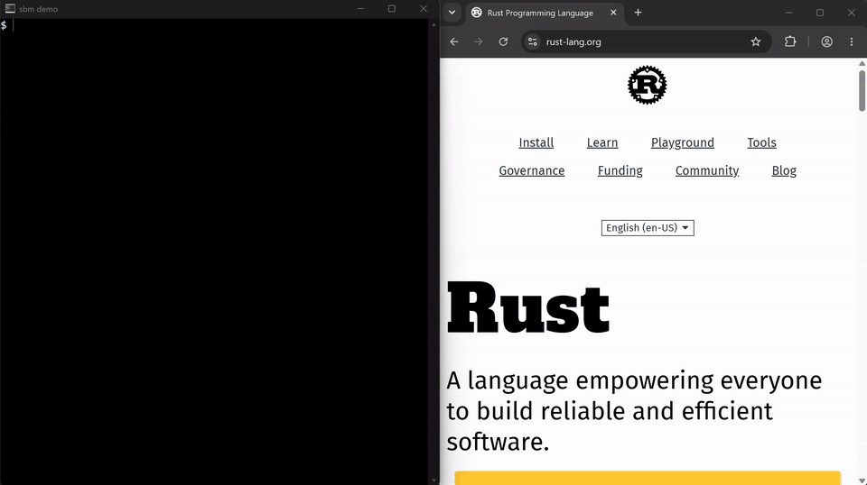

# sbm-sync

sbm-sync keeps your [sbm](https://github.com/equwal/sbm) bookmark file the
same on each of your devices: bm on your computers, the sbm app for Android
and the sbm add-on for Firefox and Chrome.

The demo (80 seconds, also as [MP4](demo/sbm-demo.mp4)): bm adds a bookmark
in a terminal. The add-on in the browser shows it, and adds the page that it
shows. After `bm-sync`, bm has that bookmark too. All through
sbmsync.com.

It is one small Go program. It keeps its data in plain files: no database.
The only dependency is `golang.org/x/crypto` for bcrypt.

The clients use **https://sbmsync.com** unless you set another server.
Sync on that server is free. You can also run your own server. The old
address, sbm.subread.space, still works for the clients that use it.

## How sync works

A device sends its whole bookmark file and the name of the version that it
got last time. The server merges the changes of the device into its own
copy, keeps the result and sends it back. The device writes the result to
its file and keeps the new version name.

The merge compares whole lines:

- A line that the device removed since its last version goes.
- A line that the device added comes in, at the end of the file, where bm
  adds bookmarks. When the server has another line for the same bookmark
  (the same URL, as bm compares URLs), the line of the device takes its
  place. So an edit on a device wins.
- Lines that other devices added stay.

When the server does not know the last version of a device (for its first
sync), nothing is removed: the result is the union of both files.

## Bookmarks on the web

After you sign in, the page **/bookmarks** shows your bookmarks in any
browser, also on a phone. The home page then has the search box too. The
page does what bm does:

- Search as fzf does, with the search of the add-on. The results change
  while you type, and Enter opens the first result (Ctrl+Enter: in a new
  tab), as in the add-on. Pick a tag. Sort by date, URL, description or
  tag. Text that no bookmark matches opens as an address, or as a web
  search.
- Search from the address bar of the browser: type sbm, a space and your
  words. Pages link to an OpenSearch description, `/opensearch.xml`, and
  the bookmarks page tells the address to add:
  `https://sbmsync.com/bookmarks?q=%s`.
- Add a bookmark. A URL that is a bookmark already is refused.
- Edit or delete a bookmark.
- Edit the whole file, as `bm -e` does.
- Import the HTML file that a browser exports, as
  `bm-import bookmarks.html | bm --merge` does: folders become tags, and
  known URLs are skipped. A file of bookmark lines works too.
- Download the file.

Each change goes through the same merge as a sync, so the changes that your
devices made since the page opened stay. The only script is `search.js`,
for the search while you type: it gets the results from the server. Without
it, the search form works too.

The pages obey the rules of sync: the email address must be confirmed, and
with billing on, the account needs its trial or a subscription. The
download always works, because the bookmarks belong to their owner.

## Feeds

After you sign in, the page **/feed** follows RSS and Atom feeds for you.
It uses [sfeed](https://codemadness.org/sfeed.html) on the server:

- Follow a feed: type its address and a name. The list is one plain file,
  `feeds.txt`, with one feed on each line: the URL, a tab and the name.
  A new account starts with the default feeds of the server
  (`SBM_DEFAULT_FEEDS`; on sbmsync.com, the feed of recentlywritten.com).
  You can unfollow them like any other feed.
- The server fetches the feeds every 30 minutes with `sfeed_update` and
  shows the items newest first, with the feed, the time and the author. A
  setting opens the links in a new tab.
- Explore: turn it on, and the server looks through your bookmarked pages
  for feeds with `sfeed_web`, 20 pages with each update, and offers what it
  finds.
- Digest: the server sends you the new items by email once a day, in the
  form of `sfeed_plain`, unless you turn that off in the settings of the
  page. The first day sends nothing, so that you do not get the whole
  history. A server without an SMTP server sends no digest.

Read the feed in a terminal with the token of a device (`bm-sync login`
keeps one in `~/.config/sbm/sync`):

    curl -H "Authorization: Bearer $token" https://sbmsync.com/api/feed | sfeed_plain
    curl -H "Authorization: Bearer $token" https://sbmsync.com/api/feeds

`/api/feed` gives the items of all your feeds in the sfeed format, newest
first, so `sfeed_plain`, `sfeed_curses`, `sfeed_html` and the other sfeed
tools read it. `/api/feeds` gives `feeds.txt`.

The feed job fetches only feeds and pages on the public internet: an
address that points to a private network, or to the server itself, is
skipped. The job runs as the command `sbm-sync feed`; `contrib/` has a
systemd service and a timer for it, and `contrib/deploy.sh` installs them
together with the server.

## Protocol

Plain HTTP, for any client with curl.

    POST /api/login        form fields email, password
                           200: a token, as text
    POST /api/sync?base=V  Authorization: Bearer <token>
                           body: the bookmark file
                           200: the merged file; header Sbm-Version: <new V>
    POST /api/logout       Authorization: Bearer <token>
    GET  /api/account      Authorization: Bearer <token>
                           200: JSON: email; state, one sentence; plans,
                           the subscriptions that the account can start,
                           each with id and label; portal, true when
                           /api/portal works; terms, the address of the
                           terms of sale; the payment links support,
                           manage, teams and teams_large, when the server
                           has them
    POST /api/checkout     Authorization: Bearer <token>; form field plan
                           (an id from plans)
                           200: the address of a Stripe Checkout page
    POST /api/portal       Authorization: Bearer <token>
                           200: the address of the Stripe customer portal
    GET  /api/feed         Authorization: Bearer <token>
                           200: the items of all feeds, newest first, in
                           the sfeed(5) format, one item on each line
    GET  /api/feeds        Authorization: Bearer <token>
                           200: the feeds, one on each line: URL, tab, name

Errors come as text: 401 (sign in again), 402 (the subscription or the
trial has ended), 403 (confirm the email address first), 404 (the server
has no billing), 409 (a subscription exists already, or no billing exists
yet), 413 (the file is larger than 4 MB), 429 (too many sign-in attempts).

The add-on opens the Stripe pages in a new tab. After them, Stripe shows
the page `/done` of the server, which tells the user to go back to the
add-on.

    curl -d email=me@example.org --data-urlencode password=... https://sbmsync.com/api/login
    curl -H "Authorization: Bearer $token" --data-binary @bookmarks \
        "https://sbmsync.com/api/sync?base=$version"

## Run your own server

This repository has all the source code of the server, under the
AGPL-3.0. You need a machine with a domain name that points to it.

### With Docker

Ports 80 and 443 must be open. Caddy gets the TLS certificate by itself.

    git clone https://github.com/equwal/sbm-sync
    cd sbm-sync
    cp .env.example .env    # then set SBM_DOMAIN in .env
    docker compose up -d

The data is in the Docker volume `sbm-data`. To back it up:

    docker compose cp sbm-sync:/data ./backup

To update, run `git pull`, then `docker compose up -d --build`.

### Without Docker

    go build
    SBM_URL=https://sbm.example.org ./sbm-sync

Then put it behind a web server that does TLS. `contrib/` has a systemd unit,
an nginx site and a Caddyfile. With Go installed on another computer:

    GOOS=linux GOARCH=amd64 CGO_ENABLED=0 go build

For the feeds, install `sfeed` (a Debian package) and run `sbm-sync feed`
every 30 minutes with the same environment as the server:
`contrib/sbm-feed.service` and `contrib/sbm-feed.timer` do that with
systemd. `sh contrib/deploy.sh root@sbm.example.org` builds the server,
installs it, the timer and sfeed on the server, and restarts the service.

### Connect the devices

Sign in with the address of your server: `bm-sync login
https://sbm.example.org` on a computer. In the add-on and the app, type the
address in the field "Sync server".

### Settings

All settings come from the environment. With Docker, put them in `.env`.

    SBM_URL         public address of the server (default http://localhost:8750)
    SBM_ADDR        address to listen on (default 127.0.0.1:8750)
    SBM_DATA        data directory (default ./data)
    SBM_CONTACT     email address on the privacy page (optional)
    SBM_TEAMS_URL   page that pre-sells team bookmarks for up to 10
                    people (optional): the home page links to it
    SBM_TEAMS_LARGE_URL  the same for teams of 11 people or more
    SBM_SUPPORT_URL page of a supporter subscription (optional): the home
                    page and the account page link to it
    SBM_MANAGE_URL  page where supporters manage or cancel their
                    subscription, such as the login link of the Stripe
                    customer portal (optional, with SBM_SUPPORT_URL)
    SBM_TRIAL_DAYS  days of sync before payment, with billing on (default 30)
    SBM_BILLING_START  date when billing starts, as 2026-10-01: accounts
                    from before it get the full trial from that date
    SBM_SMTP_HOST   SMTP server that sends email (optional)
    SBM_SMTP_PORT   its port (default 587, with STARTTLS; 465 uses TLS
                    from the start)
    SBM_SMTP_USER   user name on the SMTP server
    SBM_SMTP_PASSWORD  password on the SMTP server
    SBM_MAIL_FROM   sender, as "sbm Sync <sync@example.org>" (default
                    SBM_SMTP_USER)
    SBM_DEFAULT_FEEDS  feed URLs, with spaces between them, that a new
                    account follows until it unfollows them (optional)

Without `SBM_SMTP_HOST`, the server sends no email, and accounts need no
email check. With it, each new account gets an email with a link. The
account syncs only after someone opens that link. Accounts from a time
without `SBM_SMTP_HOST` need no check.

To reset a password, the operator deletes the account in `accounts.json`
(with the server stopped), and the user signs up again. The bookmark files
stay on the devices.

## Billing

Billing is off unless `STRIPE_SECRET_KEY` is set. Without billing, sync
is free for all accounts. To turn it on:

1. In Stripe, make a product with two recurring prices, for example $3 a
   month and $30 a year.
2. Add a webhook endpoint `https://<your server>/stripe` for the events
   `checkout.session.completed`, `customer.subscription.created`,
   `customer.subscription.updated` and `customer.subscription.deleted`.
3. Turn on the customer portal in the Stripe settings, so that customers
   can cancel and change their card.
4. Set these variables, then restart the server:

        STRIPE_SECRET_KEY      sk_test_... or sk_live_...
        STRIPE_WEBHOOK_SECRET  whsec_... of the endpoint
        STRIPE_PRICE_MONTH     price_... of the monthly price
        STRIPE_PRICE_YEAR      price_... of the yearly price

Keep the keys out of git: put them in the environment file of the service.

The page `/terms` shows the terms of sale, for all payments of the server.
The Chrome Web Store asks for them. To change them, edit the template
`terms` in `pages.html`.

## Data

    data/accounts.json            accounts: email, bcrypt hash, token hashes,
                                  hash of the email check code, Stripe
                                  customer and subscription state
    data/files/<account>/<sha256> the last 50 versions of each bookmark file
    data/files/<account>/HEAD     name of the current version
    data/feeds/<account>/         the feeds: feeds.txt, the sfeedrc made
                                  from it, items/<feed> from sfeed_update,
                                  explore, and the state of the digest

To back up, copy the directory.

## Test

    go vet ./... && go test ./...

The merge has property tests (with [rapid](https://github.com/flyingmutant/rapid)).

## License

AGPL-3.0. If you run a changed version for other people, give them its
source code.

If sbm is useful to you, you can support it on [Ko-fi](https://ko-fi.com/truex).
